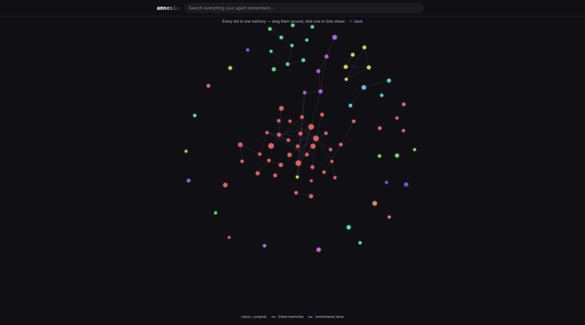

# amnesia

**Give your agent selective amnesia. See, search, and clean every memory Claude Code has saved about you — and let Claude audit its own memory for contradictions.**

  



*A real store: 84 memories across 21 projects. Every dot is one memory, colors are projects, lines are the references between them — contradictions glow red after a scan. Live, draggable, and clickable in the built-in UI.*

Claude Code quietly accumulates memory files per project directory under `~/.claude/projects/*/memory/`. Over months that store rots: facts go stale ("service X is live" — it was retired weeks ago), the same rule gets saved three times in three projects, and memories from one project leak into sessions for another. Research on agent memory calls this *memory contamination*, and polluted memory measurably makes agents worse than no memory at all.

amnesia is one sentence, one button, one question at a time:

1. Open it: *"Your agent remembers 84 things about you, across 21 projects."* One button: **Scan**.
2. The scan feeds your whole store to your own `claude` CLI and flags **contradictions**, **stale facts**, **duplicates**, and **misfiled memories**.
3. **Review** walks you through the flags one at a time, in plain language — *"These can't both be true"*, *"This seems filed in the wrong project"* — with one-word answers: Forget, Move it, Combine them, Keep both. Decisions survive reloads until the next successful scan, which asks again from fresh evidence. In a hurry? **Fix all** previews every confident consolidation, then applies them as one undoable batch.
4. Every change is reversible: Amnesia snapshots each affected memory and index before changing it. Undo is right there in the toast and under **Recent changes**; it refuses to overwrite a file you edited afterward.

Search, a browse-everything view with project filters, date/size sorting, and **the map** — the live force-graph above, physics hand-rolled in ~100 lines of dependency-free canvas — are each one click away, never the default.

## Install

**As a Claude Code plugin** — you already have everything it needs:

```
/plugin marketplace add tiny-cloud-ventures/amnesia
/plugin install amnesia@amnesia
```

Then `/amnesia:open` opens the UI, and `/amnesia:scan` audits your memory without leaving the session.

**As a CLI** (requires Python 3.9+):

```sh
uvx --from git+https://github.com/tiny-cloud-ventures/amnesia amnesia
```

**Or the zero-tooling way** — it's a single file, stdlib only:

```sh
curl -O https://raw.githubusercontent.com/tiny-cloud-ventures/amnesia/main/amnesia.py
python3 amnesia.py
```

## Use

```sh
amnesia            # UI at http://localhost:8780 — scan, review, done
amnesia analyze    # same audit, from the terminal
amnesia 9000       # different port
```

Or, with the plugin: `/amnesia:open` and `/amnesia:scan`.

## Yours, local, reversible

- **Nothing leaves your machine.** The UI binds to localhost only. No accounts, no API keys, no telemetry, no server. Changes require a same-session, same-origin JSON request.
- **The only thing that ever reads your memories is the Claude account you already use.** The scan pipes your store through your own `claude` CLI — the same subscription Claude Code runs on.
- **Nothing is ever deleted.** Forgotten and merged source files move to `~/.claude/memory-trash/`; every forget, move, merge, and Fix all batch also gets a local recovery snapshot under `~/.claude/amnesia/history/`.

## Why this matters

Unscoped, stale memory is negative-value: an agent that "remembers" your old port number or a retired service confidently applies it to today's work. The fix isn't remembering more — it's forgetting and fencing correctly. amnesia is the smallest honest tool for that: full visibility, safe deletion, and an LLM audit of the store's internal consistency.

The analyzer also proposes **consolidation ops** — MOVE a memory to the project directory it actually belongs to, MERGE a duplicate into its canonical copy — each applied with one click, trash-backed. Cross-repo consolidation with human approval is the core idea: every mainstream memory system (ChatGPT, Claude.ai, Mem0, Zep) consolidates silently; none lets you review the merge. See `docs/` for the research this design is based on.

## Roadmap

- Archive state (soft-disable a memory and see if anything breaks before deleting)
- Supersede-don't-delete: rewrite stale facts in place with a `superseded:` marker instead of trashing
- Gated PROMOTE op: hoist a fact to global scope only when observed in 2+ repos, with provenance
- Memory support for more agents (Cursor rules, plain CLAUDE.md files)

Issues and PRs welcome — see [CONTRIBUTING.md](CONTRIBUTING.md). One rule above all: zero dependencies is the product.

## License

MIT
